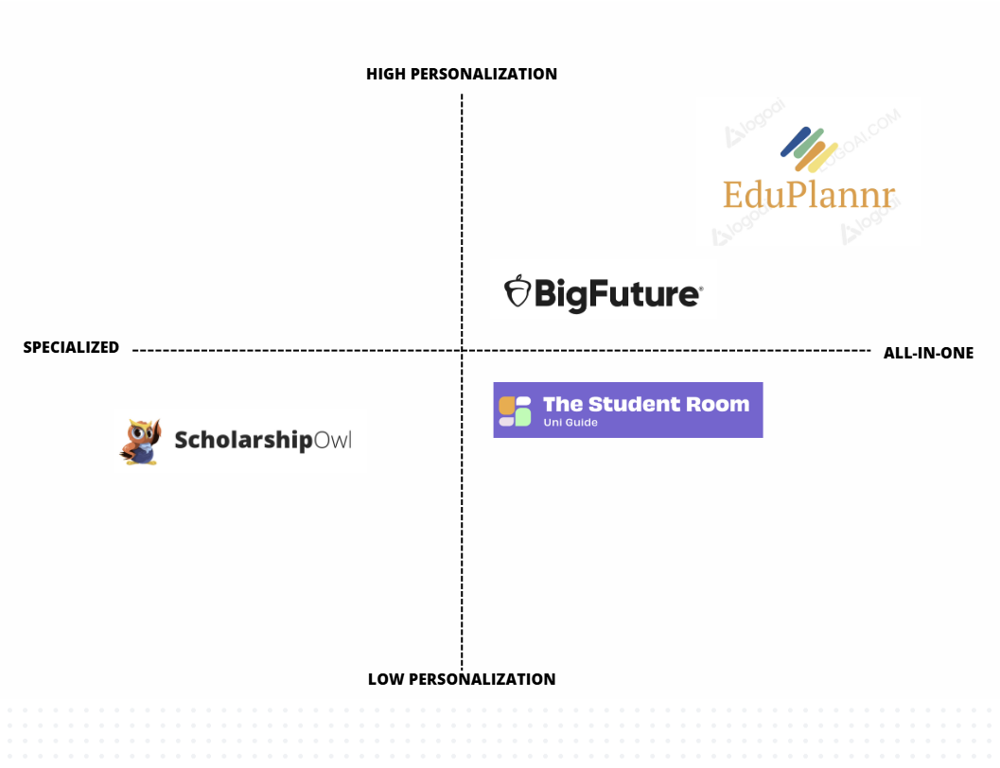

# Competitive Analysis: Higher Study Planner & Scholarship Helper

## ► Competitor Overview

| **Product**    | **Core Features**                                                                                     | **Target Audience**                          |
|--------------------|------------------------------------------------------------------------------------------------------|----------------------------------------------|
| **The Uni Guide**       | University search, course comparison, deadline tracker                                                | High School Students, undergraduate & graduate students           |
| **BigFuture(CollegeBoard)**      | College Search & Comparison,Scholarship Search,Financial Aid Guidance                                     | High School students |
| **ScholarshipOwl**    | Scholarship matching, real-time updates, personalized notifications                                   | Students seeking financial aid              |
| **EduPlannr (Our Platform)**   | Track scholarships, university finder, AI assistant, GRE/SAT/TOEFL contents, budget calculation, professor finder, deadlines with task management, SOP, application helper (visa, scholarship, financial aid, program) | Broad student audience                       |

## ► Feature Comparison

| **Feature**                   | **EduPlannr** | **ScholarshipOwl** | **BigFuture(CollegeBoard)** | **The Uni Guide**           |
|-------------------------------|--------------|---------------|-----------------|-----------------------------|
| University search             | ✔            | ✔             | ✖               | ✔                           |
| Course comparison             | ✔            | ✖             | ✖               | ✔                           |
| Exam prep tools               | ✔            | ✖             | ✖               | ✖                          |
| Scholarship matching          |  ✔            | ✔              | ✔               | ✖                          |
| Real-time updates             |  ✔            | ✔              | ✔               | ✖                          |
| Personalized dashboard        |  ✔            | ✖             | ✖               | ✖                           |
| Community forum               |  ✔            | ✖             | ✖               | ✖                         |
| Document management           | ✔            | ✖             | ✖               | ✖                           |
| AI Assistant                  | ✔            | ✖             | ✖               | ✖                           |
| Budget calculation            | ✔            | ✖             | ✖               | ✔                        |
| Professor finder              | ✔            | ✖             | ✖               | ✖                          |
| Application helper            | ✔            | ✖             | ✖               | ✖                           |

## ► Competitive Landscape

### **Competitive Positioning**

| **Platform**               | **Strengths**                                                                                                                                       | **Weaknesses**                                                                                                                                      |
|----------------------------|-----------------------------------------------------------------------------------------------------------------------------------------------------|-----------------------------------------------------------------------------------------------------------------------------------------------------|
| **ScholarshipOwl**         | - Fast and automated scholarship matching.   - Saves time by allowing bulk applications.   - Personalized scholarship recommendations.        | - Focused only on scholarships, lacks other planning tools.   - Limited support for financial planning or task management.   - Premium pricing.|
| **BigFuture (CollegeBoard)**| - Comprehensive college and scholarship search.   - Trusted resource for U.S. college admissions.   - Includes college planning guides.      | - Primarily U.S.-focused, limited for international students.   - No integrated task management or AI assistance.   - No real-time budget tools.|
| **The Uni Guide**          | - Detailed information on universities and courses in the UK.   - Course-specific stats and reviews.   - User-friendly interface.             | - UK-centric platform, limited to universities and courses.   - No scholarship tracking or financial planning features.   - No AI-driven features.|
| **EduPlannr**          | - Integrated platform combining multiple key features: scholarship tracking, study planning, task management, budget calculation, and AI assistance.   - Comprehensive workflow support from planning to application.   - Unique value proposition through automation and personalization. | - New platform, may have lower brand recognition initially.   - High complexity in development and maintenance.   - Needs user trust and engagement. |

## ► SWOT Analysis

| **Strengths**                                | **Weaknesses**                             |
|---------------------------------------------|-------------------------------------------|
| - All-in-One Solution                       | - Market presence as a new entrant        |
| - Personalized experience                   | - Requires high-quality content volume    |
| - Unique community and document management |                                           |
| - AI-powered assistant                     |                                           |

| **Opportunities**                           | **Threats**                                |
|---------------------------------------------|-------------------------------------------|
| - Niche targeting in underserved regions   | - Established competitors with loyal base |
| - Strategic partnerships                   | - Data privacy concerns                   |
| - Mobile app launch                        | - Market saturation in edtech sector      |
| - Premium content & consultancy fees       | - SOP, essay review services |
| - Advertisement revenue                    |                                           |

